**Github操作手册**

# 一、安装
## 文件列表
依次按照默认安装即可
Windows列表

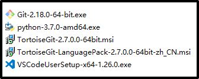

macOS列表

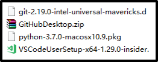

## 安装插件
vscode推荐安装插件如下，单击左边扩展按钮，按名称搜索，install即可，选择下载人数较多的目标，编写markdown文档时，单击右键preview实时查看效果。

Chinese (Simplified) Language Pack 汉化包

Markdown Preview Enhanced 预览

Markdown TOC 目录生成器

Code Spell Checker 拼写检查

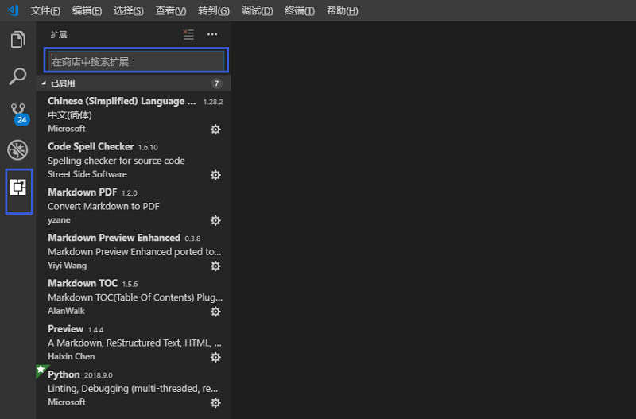

# 二、登录
## 1.进入账户
[https://github.com/login](https://github.com/login) ，提交用户名密码。
## 2.进入团队
sign in之后单击右下角习悦标志。

## 3.进入库
单击进入对应repository。

# 三、编辑
分本地和线上两种方式
## 1.本地编辑
### ①clone到本地
**方法一：githubdesktop**(MacOS、Windows皆可），打开登录→file→clone repository→选择对应名称→选择存放位置→clone

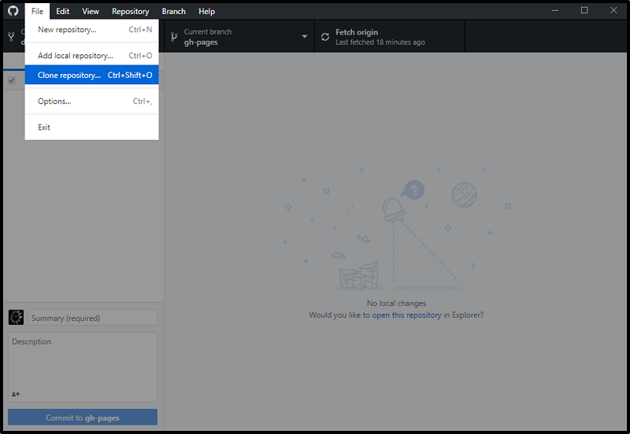
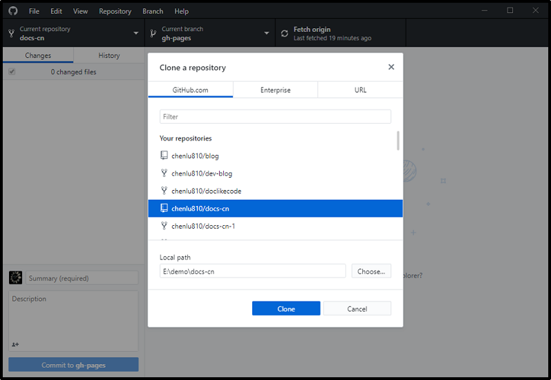
**方法二：tortoise**（仅windows）单击github网页库内clone or download→复制库的地址→进入本地电脑文件夹（不要选择桌面），右键菜单左键单击clone到本地→关闭  

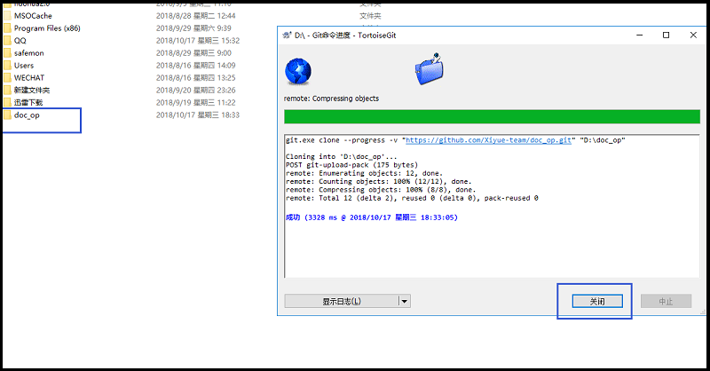
### ②修改文件
保持文件名不变，打开直接修改即可，修改之后的文件将出现红色感叹号，可单个文件提交到github库，也可批量提交。
**方法一：githubdesktop**(MacOS、Windows皆可），界面自动出现变更提示，选定文件或批量文件→撰写修改信息→单击commit to master→push origin，成功后恢复到“fetch origin”

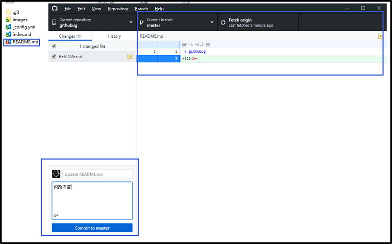
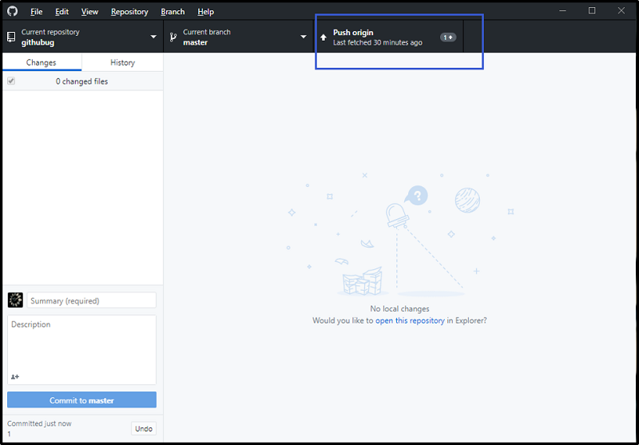
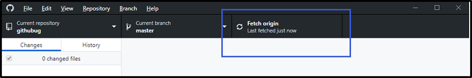
**方法二：tortoise**（仅windows）
单个提交：右键单击文件名→Git提交（C）“master”→撰写“日志信息”→提交并推送→关闭，提交成功后红色感叹号变为绿色对号

批量提交：在此文件夹根目录下空白处右键单击文件名→Git提交（C）“master”→撰写“日志信息”→提交并推送→关闭，提交成功后所有红色感叹号变为绿色对号

### ③添加文件
**方法一：githubdesktop**(MacOS、Windows皆可），界面会自动出现新增文件或文件夹提示（文件夹不可为空），选定文件或批量文件→撰写修改信息→单击commit to master→push origin，成功后恢复到“fetch origin”

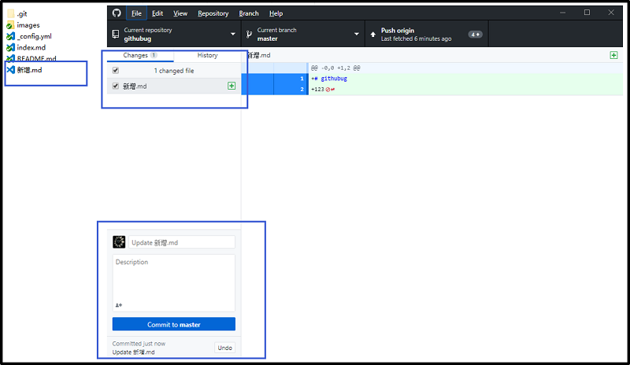
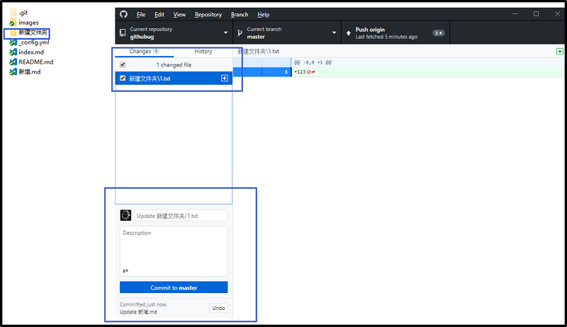

**方法二：命令行**(MacOS、Windows皆可），在根目录下放入新增文件或文件夹（不可为空）→根目录下空白处右键单击Git Bash Here→依次输入命令（见下方）→刷新库即可见更新后的内容
*命令*：复制粘贴（右键paste）单行后回车，新增原因按需修改。

>git add .

>git commit -m "新增原因"

>git push -u origin maste

## 2.线上编辑
### ①修改文件
单击需要修改的文件→单击编辑按钮→编辑→页面下方编写修改说明→commit changes

### ②添加文件
**添加单个文件**：
方法一：单击create new file→输入文件名称→编辑→页面下方编写修改说明→commit new file

方法二：单击upload files→单击choose your files→选定本地文件（可批量导入单个文件）→打开→上传完毕后呈白色状态→编写说明→commit changes

**添加文件夹**：
单击create new file→输入文件夹名（英文）/文件名（文件夹不可为空）→编辑→页面下方编写修改说明→commit new file

### ③删除文件
单击要删除的文件→单击右上角删除按钮→页面下方编写修改说明→commit changes

## 3.编辑README
编辑README形成内部文件基本描述和目录，便于查找。
### ①进入编辑状态
单击右上角编辑按钮

### ②添加内容
**基本描述：自行添加**

**目录**

>[#一级标题] (链接)

>[##二级标题] (链接)

>[###三级标题] (链接)

>[文字] (链接)

链接说明：

中括号小括号之间无空格

方法一：地址，单个文件的网址

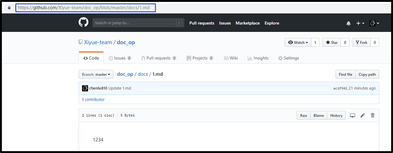

方法二：路径，文件夹的位置，文件夹/文件名

# 四、markdown语法参考
[英文版说明1](https://guides.github.com/features/mastering-markdown/)

[英文版说明2](https://www.markdownguide.org/basic-syntax)

[中文版说明1](https://shd101wyy.github.io/markdown-preview-enhanced/#/zh-cn/markdown-basics)

[中文版说明2](https://www.appinn.com/markdown/#img)

# 五、进阶使用参考
[Git中文版](https://git-scm.com/book/zh/v2)

[文档代码化](https://doclikecode.readthedocs.io/zh_CN/latest/index.html)

[Read the Docs](https://docs.readthedocs.io/en/latest/index.html#)

[sphinx](http://www.sphinx-doc.org/en/master/index.html)

