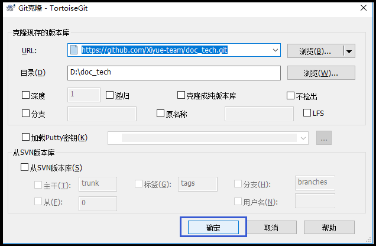

**操作手册**

# 一、登录
## 1.进入账户
[https://github.com/login](https://github.com/login) ，提交用户名密码。
## 2.进入团队
单击右下角习悦标志。

## 3.进入库
单击进入对应repository。

# 二、编辑
分本地和线上两种方式
## 1.本地编辑
**①clone到本地**
单击clone or download→复制库的地址→clone到本地（不要选择桌面）→关闭

## 2.线上编辑
